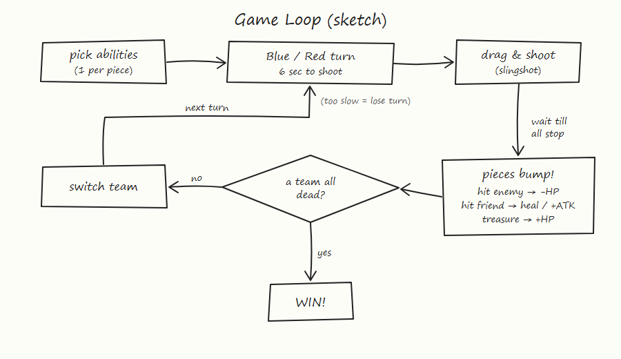

# Team 25 – 2D Physics Battle

A turn-based 2D physics battle game made with Unity. Two teams, **Blue** and **Red**, each control 3 pieces.
On your turn, you drag a piece back and release it like a slingshot. Knock enemy pieces to deal damage.
The first team to eliminate the whole enemy team wins.



## How to Play

1. **Choose abilities.** Before the match, each team gives every piece one ability. Two pieces on the same team can't have the same ability.
2. **Take turns.** Blue moves first. You have **6 seconds** to launch a piece. If time runs out, the turn goes to the other team.
3. **Launch.** Drag a piece back and release it. Pieces slide, bounce off walls and hit each other. The turn ends when every piece has stopped.
4. **Win.** Wipe out every enemy piece.

## Piece Types

| Type    | HP | ATK | Mass | Launch power |
|---------|----|-----|------|--------------|
| Heavy   | 6  | 1   | 2.0  | 0.8×         |
| Striker | 5  | 2   | 1.0  | 1.0×         |
| Speed   | 4  | 1   | 0.6  | 1.3×         |

## Abilities

| Ability           | Effect |
|-------------------|--------|
| Attack Boost      | Touch an ally on your turn: the ally gets +1 ATK (max +2 per ally). |
| Heal              | Touch an ally on your turn: the ally gets +2 HP and the healer gets +1 HP. |
| Defensive Counter | When an enemy hits this piece, the attacker takes 1 damage. |
| Extra Action      | The first time this piece kills an enemy, your team takes another turn. Works once per match. |

## Combat Rules

- **Hitting an enemy:** the enemy loses HP equal to the attacker's ATK. Only the team taking its turn deals damage.
- **Chain attack:** a piece hit by its own teammate can also deal damage for the rest of that shot.
- **Elimination:** a piece at 0 HP is removed and its killer's team scores 1 point.
- **Underdog buff:** when a piece dies, each of its surviving teammates gets +1 ATK. If only one piece is left on a team, its ATK is doubled.

## Treasures

- **Opening treasures:** Red moves second, so 2 Red treasures appear on Red's half at the start of the match.
- **Comeback treasure:** at the start of the losing team's turn, there is a 50% chance a treasure appears for them. The losing team is the one with fewer living pieces. If both teams have the same number, it's the one with less total HP.
- Touching your own treasure heals 50% of the piece's max HP. An enemy that touches it knocks it away and nobody heals.
- A treasure lasts 2 turns, one for each team.

## Getting Started

1. Install **Unity 6000.3.22f1** (Unity 6).
2. Clone this repository and open the project folder in Unity Hub.
3. Open `Assets/Scenes/PhysicsTest.unity` and press **Play**.

## Project Structure

```
Assets/
  Scripts/          Turn, match, score, treasure and ability logic
  Scripts/Combat/   Piece stats, combat and piece type definitions
  Prefabs/          Blue / Red pieces and ability variants
  PieceTypes/       Heavy, Striker and Speed stat assets
  Scenes/           PhysicsTest.unity (main scene)
Docs/               Design diagrams
CHANGES.md          Detailed change notes
```
